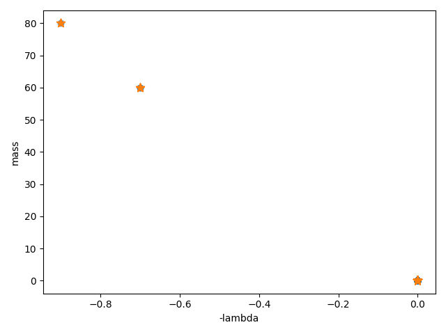

[](https://colab.research.google.com/github/tejnica/creatoria-lite/blob/main/run_demo.py)

# Creatoria-lite

Creatoria-lite is a minimal open-source prototype for design creation and optimization,
featuring a pipeline: YAML → QUBO → Simulated Annealing → CSV → Pareto.

## Quick Start

```bash
git clone https://github.com/tejnica/creatoria-lite.git
cd creatoria-lite
pip install -r requirements.txt
python run_demo.py
```

## Example Output

- Pareto front points: (0, 0), (−0.7, 60), (−0.9, 80)
- Simulations: 500 (Simulated Annealing)

Generated Pareto front from simulated solutions:



## YAML Parameters

`contradiction.yaml`

| Option         | Bits | Weight | Effect on λ |
|----------------|------|--------|-------------|
| cell_thickness | 1    | 80     | −0.9        |
| fin_height     | 1    | 60     | −0.7        |

© 2025 **Eduard Tsunsky**  – MIT license
